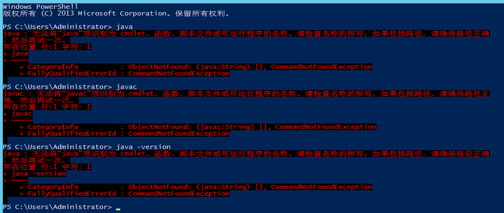

# 简述
本文档包含了后端部署过程和前端部署过程。其中后端需要的软件为jdk、tomcat、mysql等；前端需要的软件为nginx。在安装部署环境时，需要把这些软件上传到服务器上面。在执行具体的部署过程时，需要让前端开发人员打包程序、也需要后端开发人员打包程序，并需要在上传部署环境软件时，一并上传到服务器。

# 部署过程
整个部署过程包括前期准备、前后端运行软件的安装以及前后端应用程序的部署几个部分。

## 前期操作

前期操作是只在正式部署之前要做的事情，需要创建一些文件夹，用来暂时保存部署环境软件和程序。

运维人员需要在自己pc上面执行的操作：
1. 选取自己pc上的某一个盘符，创建northmeter文件夹，用于存放所有要上传的文件；
2. 打开northmeter文件夹，创建package文件夹，用来存放部署环境软件；
3. 在northmeter文件夹下面创建frontend文件夹，用来存放前端应用程序软件；
4. 在northmeter文件夹下面创建backend文件夹，用来存放后端应用程序软件；
5. 在northmeter文件夹下面创建setup文件夹，用来存放部署环境软件的安装文件；

运维人员需要在window服务器上面执行的操作：
1. 选取D盘，如果没有d盘，选取下一个磁盘，总之，不要放到c盘即可；
2. 将自己pc上面的northmeter文件夹整体上传到上一步骤选取的磁盘的根目录下面；


## 安装前端运行软件
nginx作为前端的web容器必不可少，也可以作为图片服务器，还可以作为负载均衡器和反向代理器。

### 安装nginx
- 解压nginx压缩包
将上传的nginx压缩包解压到setup文件夹内。

- 配置服务
将 nginx-service.exe、nginx-service.exe.config、nginx-service.xml 放置到 nginx.exe 同级目录下。注意，三个文件的名称要一样。

- 服务自启
找到服务窗口中的nginx服务，属性中设置自动重启，并启动起来。

- 注意：
如果启动出现问题，查看是否是因为端口冲突。

### 部署前端
运维人员将打包好的前端文件放置到nginx安装路径下面的html文件夹路径下面即可。

## 安装后端运行软件

### 安装jdk

- 查看是否已经安装
打开cmd命令行，依次输入`java`、`javac`、`java -version`命令，查看是否能够有正确的输出；如下图，即没有jdk运行环境：


- 解压jdk压缩包
将上传好的jdk压缩包解压到setup文件夹内。

- 配置环境变量
```
配置环境变量分为好几个步骤：
1. 拷贝jdk的解压路径，备用；
2. 打开环境变量窗口：右键“我的电脑” -- “属性” -- “系统高级设置” -- “环境变量” -- “新增系统变量”；
3. 设置javahome的环境变量名： JAVA_HOME，变量值： 第一步拷贝的jdk解压路径；
4. 设置classpath的环境变量： CLASS_PATH，变量值： .;%JAVA_HOME%\lib\dt.jar;%JAVA_HOME%\lib\tools.jar;
5. 修改path的变量值： 在变量值的最后面添加： ;%JAVA_HOME%\bin;

注意：上面的两个变量值不要忘记“.”和“;”。
````


- 测试
再次打开cmd命令行，依次输入`java`、`javac`、`java -version`命令，查看是否正确输出，如下图，即表示jdk安装成功：


### 安装tomcat
- 解压tomcat压缩包
将上传的tomcat压缩包解压到setup文件夹内。

- 配置环境变量
```
配置tomcat的环境变量的过程跟配置jdk的环境变量过程基本一致。有些许不同：
1. 拷贝tomcat的解压路径，备用；
2. 打开环境变量窗口：右键“我的电脑” -- “属性” -- “系统高级设置” -- “环境变量” -- “新增系统变量”；
3. 设置CATALINA_HOME的环境变量名：CATALINA_HOME，变量值： 第一步拷贝的tomcat解压路径；
4. 设置CATALINA_BASE的环境变量名：CATALINA_BASE，变量值： 第一步拷贝的tomcat解压路径；
```

- 安装服务
使用管理员身份运行cmd，进入到bin目录下，输入service.bat install
如下图所示：


- 服务自启动
任务栏的中找到tomcat服务，设置为开机自启；

- 测试
在浏览器中输入： http://localhost:8080

### 安装mysql
略。

### 部署后端项目
后端配置好数据库连接及数据库用户名和密码等重要信息后进行打包。运维人员将打包好的war放置到tomcat的webaap文件夹下面，tomcat会自动解压运行。然后浏览器访问：http://localhost:8080
